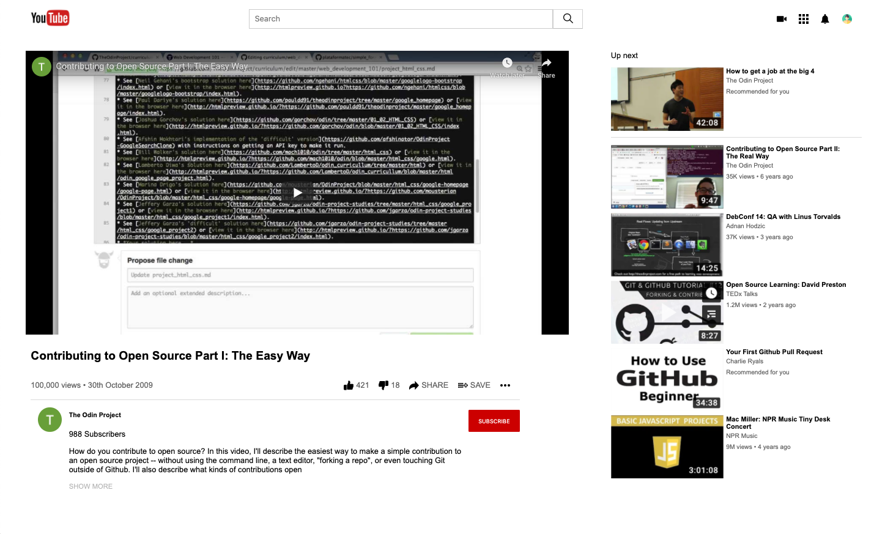

# YouTube Clone
**This project is a visual clone of popular video-sharing website, YouTube.**

​

​

This project demonstrates some basics of HTML & CSS: positioning, styling and embedding.
​
## Built With
- HTML
- CSS
​
## Getting Started
​
**To download the contents of this repository to your local workspace, follow these instructions:**

- Open Terminal
- Navigate to your desired location for the repository.
- Copy and paste the following code into the terminal: git clone https://github.com/Joseph-Burke/embedding-images-and-video.git
- Hit enter
- Once the contents are downloaded, you can open the index.html file in a browser of your choosing.
​
### Prerequisites

- A computer.
- Connection to the internet.
- A browser of preference.
​
## Authors
​
👤 **Mark Rode**
​
- GitHub: [@m15e](https://github.com/m15e)

👤 **Joe Burke**
​
- GitHub: [@Joseph-Burke](https://github.com/Joseph-Burke)
- Twitter: [@__joeburke](https://twitter.com/__joeburke)
- LinkedIn: [Joseph-Burke](https://www.linkedin.com/in/joseph-burke-b7a8261a5/)
- E-mail: joseph_burke@outlook.com
​
## �� Contributing
​
The best contribution you can make is your thoughts. Tell us what you liked and what you thought could be improved by creating an issue or reaching out on social media. We don't bite.
​
## Show your support
​
Give a ⭐️ if you like this project and follow us for more great projects like this one.
​
## Acknowledgments
- This project was completed as part of our course at [Microverse](https://www.microverse.org/).
- Thanks to YouTube for their inspiring website.
​
## �� License
​
This project is [MIT](lic.url) licensed.
